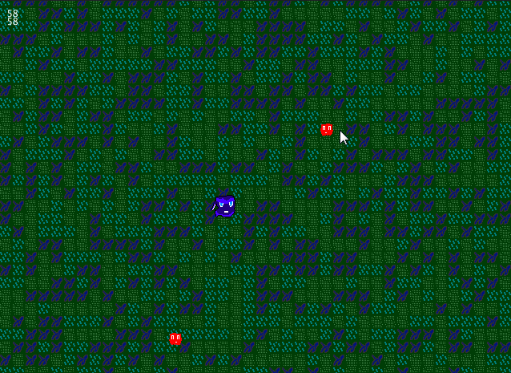
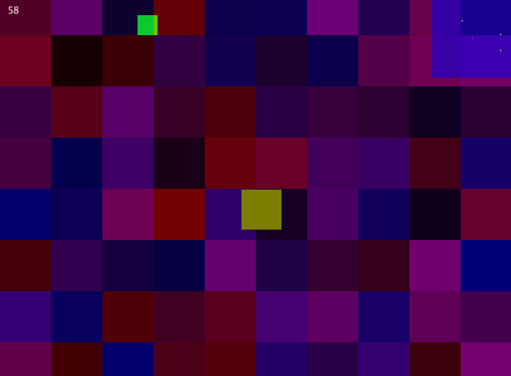

# Oak 
### A pure Go game engine
[](https://godoc.org/github.com/oakmound/oak)
[](https://goreportcard.com/report/github.com/oakmound/oak)
[](https://codecov.io/gh/oakmound/oak)
[](https://github.com/avelino/awesome-go)

## Table of Contents
1. [Installation](#installation)

1. [Motivation](#motivation)

1. [Features](#features)

1. [Support](#support)

1. [Quick Start](#quick-start)

1. [Implementation and Examples](#examples)

1. [Finished Games](#finished-games)

***

## Installation <a name="installation"/>
`go get -u github.com/oakmound/oak/v2/...`

Or in GOPATH mode (not using go modules):

`go get -u github.com/oakmound/oak/...`


## Motivation <a name="motivation"/>
The initial version of oak was made to support Oakmound Studio's game,
[Agent Blue](https://github.com/OakmoundStudio/AgentRelease), and was developed in parallel.
Oak supports Windows with no dependencies and Linux with limited audio dependencies. We don't own a machine to check with, but hypothetically it supports OSX as well.
 We hope that users will be able to make great pure Go games with oak and welcome improvements.
 
 Because Oak wants to have as few non-Go dependencies as possible, Oak does not use OpenGL or [GLFW](https://github.com/go-gl/glfw).
 We're open to adding support for these in the future for performance gains, but we always want
 an alternative that requires zero or near-zero dependencies.

 
## Features <a name="features"></a>
1. Window Rendering
    - Windows and key events forked from [shiny](https://github.com/oakmound/shiny)
    - Logical frame rate distinct from Draw rate
    - Fullscreen, Window Positioning support
    - Auto-scaling for screen size changes
1. [Image Management](https://godoc.org/github.com/oakmound/oak/render)
    - `render.Renderable` interface
    - Sprite Sheet Batch Loading at startup
    - Manipulation
        - `render.Modifiable` interface
        - Built in Transformations and Filters
        - Some built-ins via [gift](https://github.com/disintegration/gift)
        - Extensible Modification syntax `func(image.Image) *image.RGBA`
    - Built in `Renderable` types covering common use cases
        - `Sprite`, `Sequence`, `Switch`, `Composite`
        - Primitive builders, `ColorBox`, `Line`, `Bezier`
        - History-tracking `Reverting`
    - Primarily 2D
1. [Particle System](https://godoc.org/github.com/oakmound/oak/render/particle) 
    - <details>
      <summary>Click to see gif captured in examples/particle-demo</summary>
      
        
    </details>
1. [Mouse Handling](https://godoc.org/github.com/oakmound/oak/mouse)
    - Click Collision
    - MouseEnter / MouseExit reaction events
    - Drag Handling
1. [Joystick Support](https://godoc.org/github.com/oakmound/oak/joystick)
    - <details>
      <summary>Click to see gif captured in examples/joystick-viz</summary>
      
        
    </details>
1. [Audio Support](https://godoc.org/github.com/oakmound/oak/audio)
    - Positional filters to pan and scale audio based on a listening position
1. [Collision](https://godoc.org/github.com/oakmound/oak/collision)
    - Collision R-Tree forked from [rtreego](https://github.com/dhconnelly/rtreego)
    - [2D Raycasting](https://godoc.org/github.com/oakmound/oak/collision/ray)
    - Collision Spaces
        - Attachable to Objects
        - Auto React to collisions through events
        - OnHit bindings `func(s1,s2 *collision.Space)`
        - Start/Stop collision with targeted objects
1. [2D Physics System](https://godoc.org/github.com/oakmound/oak/physics)
    - Vectors
        - Attachable to Objects / Renderables
        - Friction
1. [Event Handler, Bus](https://godoc.org/github.com/oakmound/oak/event)
    - PubSub system: `event.CID` can `Bind(fn,eventName)` and `Trigger(eventName)` events
1. [Shaping](https://godoc.org/github.com/oakmound/oak/shape)
    - Convert shapes into: 
        - Containment checks
        - Outlines
        - 2D arrays
1. [Custom Console Commands](debugConsole.go)
1. [Logging](https://godoc.org/github.com/oakmound/oak/dlog)
    - Swappable with custom implementations
    - Default Implementation: 4 log levels, writes to file and stdout

## Support <a name="support"></a>

For discussions not significant enough to be an Issue or PR, see the #oak channel on the [gophers slack](https://invite.slack.golangbridge.org/). 

## Quick Start <a name="quick-start"></a>
This is an example of the most basic oak program:

```go

oak.Add("firstScene",
    // Initialization function
    func(prevScene string, inData interface{}) {}, 
    // Loop to continue or stop the current scene
    func() bool {return true}, 
    // Exit to transition to the next scene
    func() (nextScene string, result *scene.Result) {return "firstScene", nil}) 
oak.Init("firstScene")
```

See the [examples](examples) folder for longer demos, [godoc](https://godoc.org/github.com/oakmound/oak) for reference documentation, and the [wiki](https://github.com/oakmound/oak/wiki) for more guided feature sets, tutorials and walkthroughs.

## Implementation and Examples <a name="examples"></a>

### Platformer


Build up to having a simple platforming game by doing the following: Setup a character, get it to move, set basic gravity, get it to jump, make it only jump on solid ground, put it all together.


```go

char := entities.NewMoving(100, 100, 16, 32,
	render.NewColorBox(16, 32, color.RGBA{255, 0, 0, 255}),
nil, 0, 0)
```


```go 

char.Bind(func(id int, nothing interface{}) int {
	char := event.GetEntity(id).(*entities.Moving)

	// Move left and right with A and D
	if oak.IsDown(key.A) {
		char.Delta.SetX(-char.Speed.X())
	} else if oak.IsDown(key.D) {
		char.Delta.SetX(char.Speed.X())
	} else {
		char.Delta.SetX(0)
	}
	oldX, oldY := char.GetPos()
    char.ShiftPos(char.Delta.X(), char.Delta.Y())
	return 0
}, event.Enter)
```


### Top Down Shooter

Learn to use the collision library and make short term shots that collide with the entites marked with collision labels.





### Radar

Often times you might want to create a minimap or a radar for a game, check out this example for a barebones implementation



### Slideshow

A different way to use the oak engine.


## Examples of Finished Games <a name="finished-games"/>

[Agent Blue](https://oakmound.itch.io/agent-blue)


[Fantastic Doctor](https://github.com/oakmound/lowrez17)


[Jeremy The Clam](https://github.com/200sc/jeremy)


