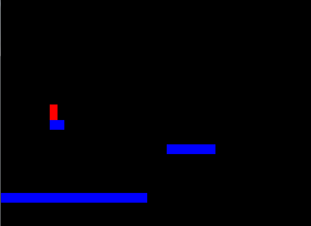
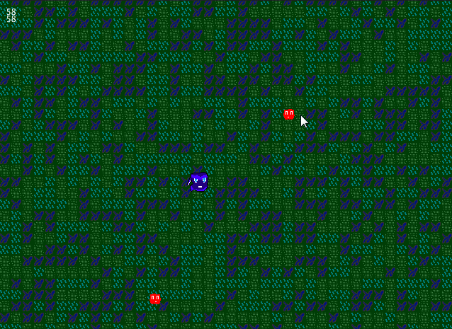
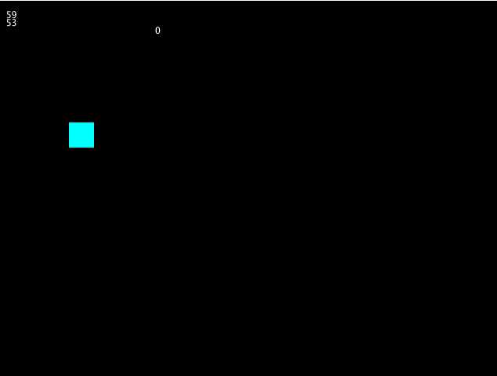
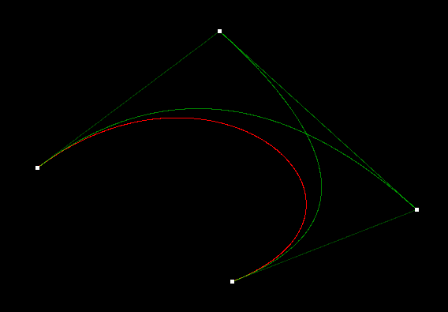
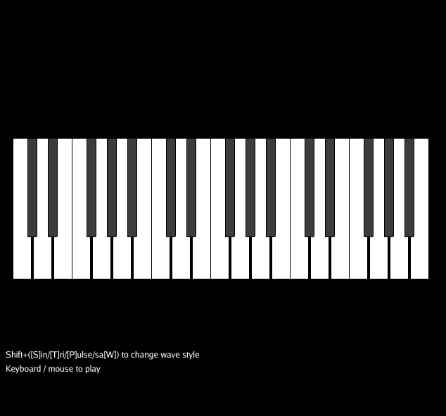
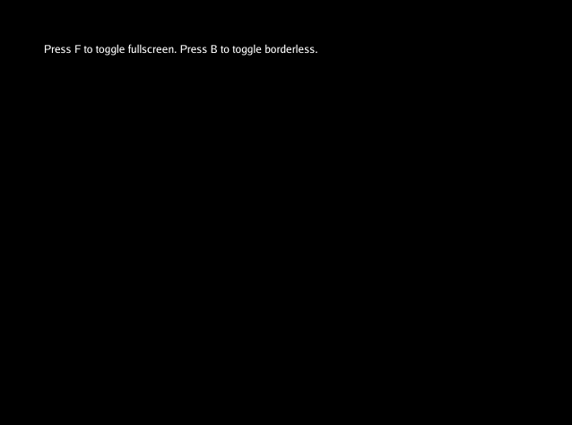
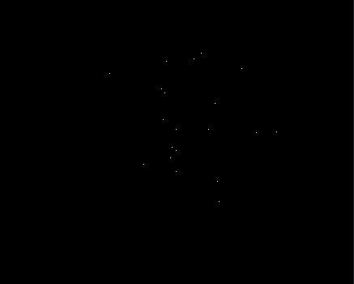

# Oak

## A Pure Go game engine

[](https://pkg.go.dev/github.com/oakmound/oak/v4)
[](https://codecov.io/gh/oakmound/oak)
[](https://github.com/avelino/awesome-go)

## Table of Contents

1. [Installation](#installation)

1. [Features](#features)

1. [Support](#support)

1. [Quick Start](#quick-start)

1. [Examples](#examples)

1. [Finished Games](#finished-games)

***

## Installation <a name="installation"/>

`go get -u github.com/oakmound/oak/v4`

## Features and Systems <a name="features"></a>

1. Window Management
    - Windows and key events forked from [shiny](https://pkg.go.dev/golang.org/x/exp/shiny)
    - Support for multiple windows running at the same time
1. [Image Rendering](https://pkg.go.dev/github.com/oakmound/oak/v4/render)
    - Manipulation
        - `render.Modifiable` interface
        - Integrated with optimized image manipulation via [gift](https://github.com/disintegration/gift)
    - Built in `Renderable` types covering common use cases
        - `Sprite`, `Sequence`, `Switch`, `Composite`
        - Primitive builders, `ColorBox`, `Line`, `Bezier`
        - History-tracking `Reverting`
    - Primarily 2D
1. [Particle System](https://pkg.go.dev/github.com/oakmound/oak/v4/render/particle)
1. [Mouse Handling](https://pkg.go.dev/github.com/oakmound/oak/v4/mouse)
1. [Joystick Support](https://pkg.go.dev/github.com/oakmound/oak/v4/joystick)
1. [Audio Support](https://pkg.go.dev/github.com/oakmound/oak/v4/audio)
1. [Collision](https://pkg.go.dev/github.com/oakmound/oak/v4/collision)
    - Collision R-Tree forked from [rtreego](https://github.com/dhconnelly/rtreego)
    - [2D Raycasting](https://pkg.go.dev/github.com/oakmound/oak/v4/collision/ray)
    - Collision Spaces
        - Attachable to Objects
        - Auto React to collisions through events
1. [2D Physics System](https://pkg.go.dev/github.com/oakmound/oak/v4/physics)
1. [Event Handler](https://pkg.go.dev/github.com/oakmound/oak/v4/event)

## Support <a name="support"></a>

For discussions not significant enough to be an Issue or PR, feel free to ping us in the #oak channel on the [gophers slack](https://invite.slack.golangbridge.org/). For insight into what is happening in oak see the [blog](https://200sc.dev/).

## Quick Start <a name="quick-start"></a>

This is an example of the most basic oak program:

```go
package main

import (
    "github.com/oakmound/oak/v4"
    "github.com/oakmound/oak/v4/scene"
)

func main() {
    oak.AddScene("firstScene", scene.Scene{
        Start: func(*scene.Context) {
            // ... draw entities, bind callbacks ... 
        }, 
    })
    oak.Init("firstScene")
}
```

See below or navigate to the [examples](examples) folder for demos. For more examples and documentation checkout  [godoc](https://pkg.go.dev/github.com/oakmound/oak/v4) for reference documentation, the [wiki](https://github.com/oakmound/oak/wiki), or our extended features in [grove](https://github.com/oakmound/grove). 

## Examples <a name="examples"></a>

| | | |
|:-------------------------:|:-------------------------:|:-------------------------:|
|  [Platformer](examples/platformer) |   [Top down shooter](examples/top-down-shooter)| [Flappy Bird](examples/flappy-bird/)
|   [Bezier Curves](examples/bezier) | [Joysticks](examples/joystick-viz)| [Piano](examples/piano)|
| [Screen Options](examples/screenopts)  |   [Multi Window](examples/multi-window) | [Particles](examples/particle-demo)|

## Games using Oak <a name="finished-games"></a>

To kick off a larger game project you can get started with [game-template](https://github.com/oakmound/game-template).

| | |
|:-------------------------:|:-------------------------:|
|  [Agent Blue](https://oakmound.itch.io/agent-blue) |   [Fantastic Doctor](https://github.com/oakmound/lowrez17)
|  [Hiring Now: Looters](https://oakmound.itch.io/cheststacker) |   [Jeremy The Clam](https://github.com/200sc/jeremy)
|  [Diamond Deck Championship](https://oakmound.itch.io/diamond-deck-championship) |    [SokoPic](https://oakmound.itch.io/sokopic) 

## On Pure Go <a name="pure-go"/>

Oak has recently brought in dependencies that include C code, but we still describe the engine as a Pure Go engine, which at face value seems contradictory. Oak's goal is that, by default, a user can pull down the engine and create a fully functional game or GUI application on a machine with no C compiler installed, so when we say Pure Go we mean that, by default, the library is configured so no C compilation is required, and that no major features are locked behind C compliation.  

We anticipate in the immediate future needing to introduce alternate drivers that include C dependencies for performance improvements in some scasenarios, and currently we have no OSX solution that lacks objective C code.
